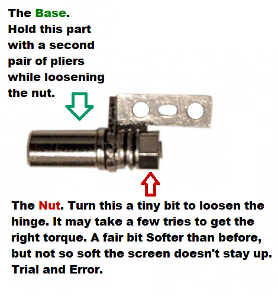

# How to loosen hinge on the Win 2

source: https://old.reddit.com/r/gpdwin/comments/bpv7dp/gpd_win2_how_to_loosen_your_hinge/

The GPD Win2 only has 1 hinge mechanism on the Left side. The right side is a hollow tube used for the LCD Cable.

This will show you how to loosen your hinge.

Note, When your hinge is out. Be sure not to twist your LCD in odd angles. You don't want to tear your LCD ribbon cable. So don't move your Win2 or LCD when the hinge mechanism isn't in the win2.

First, you'll need to remove your LCD's black plastic Back-plate. And locate the hinge on the left side. Unscrew it, and wedge it up, then slide it out.

Then Use 2 pairs of pliers and ever so slightly loosen the hinge. Maybe 1/50th of an anti(counter) clockwise turn. You want the torque to be way lower than before, so the screen is much easier to open, but not so low that the screen flops over. So you want to be softer, but still stay up when you move your win2 around.

This video will show you how to remove the back cover, and how to remove the hinge. The hinge is removed at around 1:10

https://www.youtube.com/watch?v=LyAbq06Dgfk

And this picture will show you how to loosen the hinge. What to hold and what to turn.

It may take you a few tries to get the right torque. Again, you want it to be much softer than before. But still strong enough to keep your screen up. This will cause considerably less stress and fatigue on your plastic shell, and will mitigate, or even prevent your shell from cracking or breaking.
